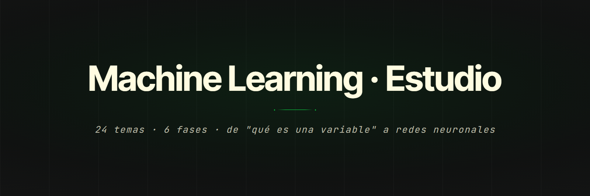

<p align="center">
  
</p>

<p align="center">
  
  
  
  
</p>

<p align="center">
  <a href="https://machine-learning-app-nu.vercel.app"><b>Ver el sitio</b></a> &nbsp;•&nbsp;
  <a href="#características">Características</a> &nbsp;•&nbsp;
  <a href="#stack">Stack</a> &nbsp;•&nbsp;
  <a href="#estructura">Estructura</a> &nbsp;•&nbsp;
  <a href="#puesta-en-marcha">Puesta en marcha</a>
</p>

Sitio de estudio de machine learning para dos amigos que arrancan de cero. Veinticuatro temas repartidos en seis fases, desde qué es una variable hasta redes neuronales. Cada tema combina teoría, diagramas que se dibujan solos al hacer scroll y ejercicios que se corrigen en el momento.

No es un producto ni una librería con audiencia externa: es material hecho a medida, con el nombre de sus dos destinatarios en el pie de cada página.

## Características

- **Veinticuatro temas, un archivo cada uno.** `data/temario.json` es la fuente de verdad: define fases, orden, slugs y números. `npm run verificar` falla si dos temas comparten slug o número, o si el prefijo del archivo no coincide con el número del tema.
- **Tres tipos de ejercicio corregidos en el cliente.** Opción múltiple, respuesta numérica con margen de tolerancia (absoluto o relativo, según el ejercicio), y Parsons: reordenar líneas de código, con puntaje parcial y una pista cuando la respuesta está cerca.
- **El progreso sobrevive sin servidor.** Se escribe primero en `localStorage` y recién después se manda al backend. Si ese `fetch` falla no se avisa nada: el dato ya está guardado local y el próximo intento lo sincroniza.
- **Login opcional sobre un sitio abierto.** La única serverless function valida tokens de Google contra su JWKS, cacheando las claves públicas hasta su vencimiento. Sin `GOOGLE_CLIENT_ID` configurado el sitio funciona igual, solo que el progreso no viaja entre dispositivos.
- **El contraste se verifica, no se estima.** `npm run contraste` calcula los pares de color en OKLab con la misma fórmula que `color-mix()` y sale con código 1 si algún token baja de su piso WCAG. Por eso hay dos grises: `--s50` da 4.52:1 sobre el fondo pero cae a 4.16:1 dentro de las tarjetas, así que el token de texto es `--s75` y `--s50` quedó restringido a ejes e íconos.
- **Matemática en KaTeX** y diagramas trazados paso a paso con GSAP sobre scroll suavizado con Lenis.

## Stack

| Capa | Tecnología | Por qué esa |
|---|---|---|
| Páginas | HTML plano, sin build | La ruta del archivo *es* la URL. Un bundler agregaría un paso sin cambiar nada de lo que ve el lector. |
| Estilos | CSS con tokens en `:root` | Seis colores de fase fijos, uno por fase, verificables por script. |
| Animación | GSAP + Lenis | Trazado progresivo de diagramas y scroll suave sin pelearse con el scroll nativo. |
| Matemática | KaTeX | Render síncrono, sin el salto de layout que trae MathJax. |
| Backend | Una serverless function en Vercel | Todo el servidor que hace falta: verificar un token y guardar progreso. |
| Tests | `node --test` | Ya viene con Node. No hay razón para sumar un runner. |

## Estructura

En la raíz vive solo lo que **es una ruta del sitio**. Los 27 HTML se quedan arriba a propósito: sin build step la ruta del archivo es la URL, y bajarlos a una carpeta cambiaría 27 direcciones sin ganar nada.

```
.
├── index.html  temas.html  muestra.html      páginas sueltas
├── concept-01…24-<slug>.html                 un archivo por tema
├── css/
│   └── shared.css                            el sistema visual entero
├── js/
│   ├── nucleo/                               compartido por todas las páginas
│   │   ├── shared.js      reveal, barra de progreso, nav entre temas, KaTeX
│   │   ├── anim.js        GSAP + Lenis: scroll, trazado de diagramas
│   │   ├── ejercicios.js  los tres tipos de ejercicio y su corrección
│   │   ├── progreso.js    estado por tema, fusión local ↔ servidor
│   │   └── diagramas.js   mecanismo de diagramas paso a paso
│   ├── paginas/           index.js, temas.js
│   └── temas/             los 24 pegamentos, uno por tema
├── api/progress.js                           única serverless function
├── data/temario.json                         fuente de verdad del temario
└── scripts/
    ├── verificar.js       integridad del temario contra los archivos
    └── contraste.js       contraste WCAG de los tokens de color
```

## Puesta en marcha

```bash
git clone https://github.com/SimonOcampo1/machine-learning-app.git
cd machine-learning-app
npm install
npx serve .          # o cualquier servidor estático
```

Se abre en `http://localhost:3000`. **No alcanza con abrir el HTML directo**: los módulos de `js/` se cargan como ES modules y el navegador los bloquea bajo `file://`.

Para habilitar el login opcional, copiar `.env.example` a `.env` y completar `GOOGLE_CLIENT_ID` con un ID de cliente OAuth de Google Cloud Console, con `http://localhost:3000` entre los orígenes autorizados.

Antes de commitear un cambio de color o de temario:

```bash
npm run check        # verificar + contraste + tests
```

## Decisiones

Los cinco libros de referencia que se usaron para armar el temario **no están en el repo** ni lo estuvieron nunca: son obras con copyright vigente y viven solo en la máquina de trabajo, ignoradas por git. El contenido de cada tema está escrito de cero, no extraído de ellos.

La taxonomía de seis colores de fase no rota ni se deriva por fórmula: son seis hex fijos tomados de la paleta de gsap.com, uno por fase, siempre el mismo. Un color calculado se ve distinto en cada fase y deja de funcionar como señal.
